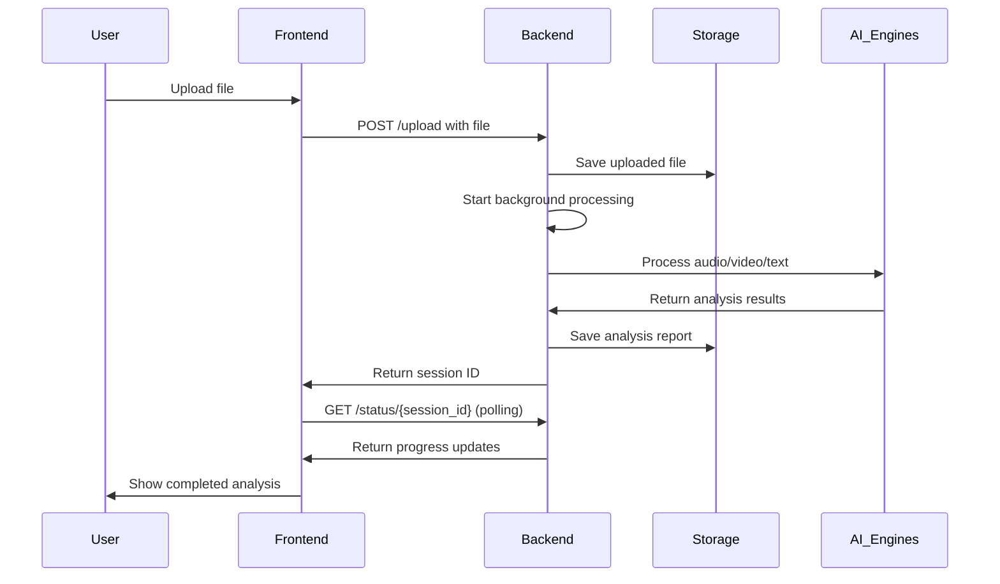
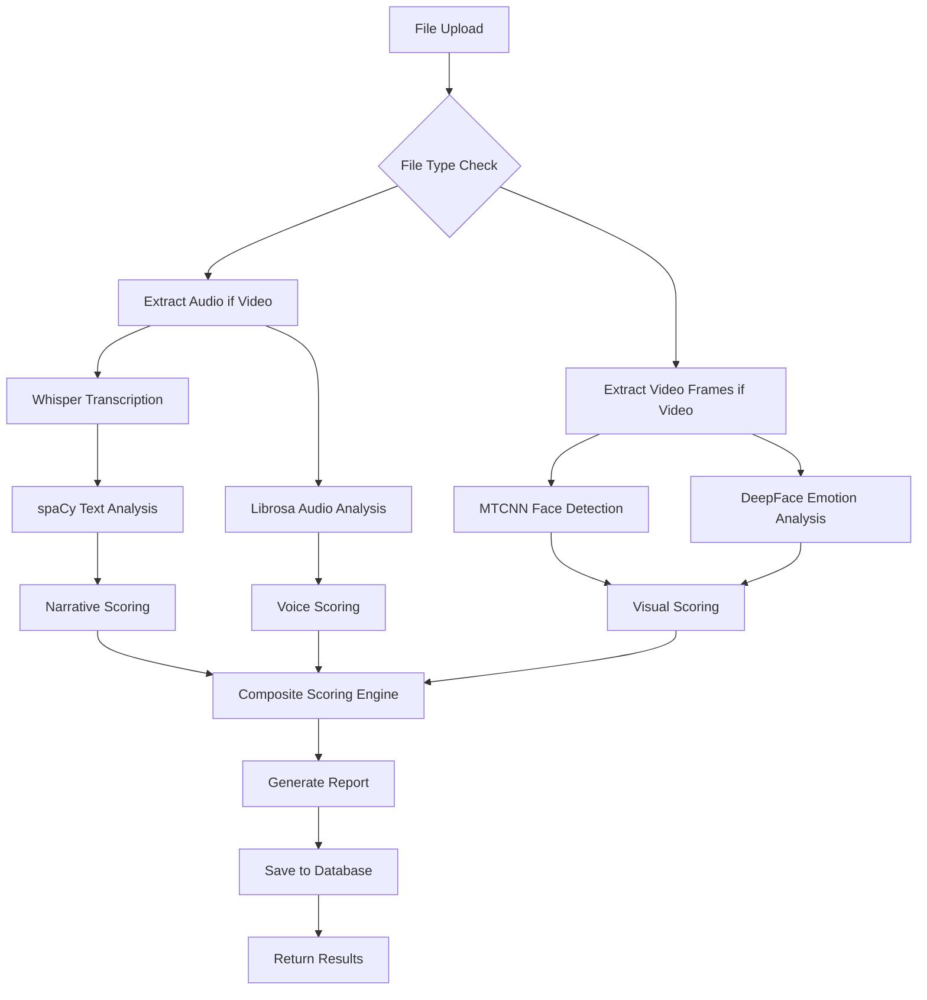

# Face2Phase - Comprehensive Project Documentation

## 1. PROJECT OVERVIEW

### Project Name
**Face2Phase** - AI-Powered Communication Analysis System

### Brief Description
Face2Phase is an advanced offline AI communication analysis platform that evaluates presentation and communication skills through multi-modal analysis of video and audio content. The system provides detailed feedback on voice delivery, visual presence, narrative clarity, and overall engagement to help users improve their communication effectiveness.

### Main Purpose and Problem It Solves
**Problem Solved:** Traditional communication training relies on subjective human feedback, which is inconsistent, expensive, and not scalable. Face2Phase provides objective, data-driven analysis of communication skills using AI to give users immediate, actionable feedback on their presentation performance.

**Purpose:** To democratize access to professional-level communication coaching by providing affordable, instant, and comprehensive analysis of communication skills through advanced AI technologies.

### Target Audience/Users
- **Primary:** Professionals seeking to improve presentation and communication skills
  - Sales professionals
  - Public speakers
  - Executives and managers
  - Students in communication/public speaking courses

- **Secondary:** Educators and trainers
  - Communication coaches
  - Corporate training departments
  - Academic institutions

- **Tertiary:** Researchers and organizations
  - HR departments for employee development
  - Communication researchers
  - Organizations requiring standardized communication assessment

### Key Features and Functionality

#### Core Analysis Features
- **Multi-modal Analysis**: Simultaneous analysis of audio, video, and text content
- **Voice Analysis**: Confidence assessment, pacing, filler word detection, pronunciation quality
- **Visual Analysis**: Facial expressions, eye contact, engagement signals (video only)
- **Text Analysis**: Vocabulary richness, expression quality, content structure
- **Composite Scoring**: Weighted algorithm combining all analysis modalities

#### User Experience Features
- **Real-time Processing**: Live progress tracking and instant results
- **Session Management**: Persistent storage and history tracking
- **Authentication**: Firebase-based user management with guest mode
- **Export Capabilities**: Professional PDF reports and data export
- **Interactive Interface**: Web-based dashboard with drag-and-drop uploads

#### Technical Features
- **Offline Processing**: All analysis done locally - no data sent to external servers
- **Scalable Architecture**: Modular design supporting multiple analysis engines
- **Privacy-First**: User data remains on local machine
- **Cross-platform**: Web-based interface accessible from any modern browser

---

## 2. TECHNOLOGY STACK

### Frontend Technologies

| Technology | Version | Why Chosen | How Implemented |
|------------|---------|------------|-----------------|
| **React** | ^18.2.0 | Modern, component-based UI framework with excellent ecosystem | Single-page application with functional components and hooks |
| **React DOM** | ^18.2.0 | Required companion to React for web rendering | Handles DOM manipulation and rendering |
| **React Router DOM** | ^6.20.0 | Industry-standard routing solution for React SPAs | Client-side routing with protected routes and navigation |
| **Framer Motion** | ^12.23.24 | Production-ready animation library for React | Smooth page transitions and interactive animations |
| **Firebase** | ^12.4.0 | Comprehensive auth and backend-as-a-service | User authentication with Google OAuth and session management |

### Backend Technologies

| Technology | Version | Why Chosen | How Implemented |
|------------|---------|------------|-----------------|
| **FastAPI** | >=0.104.1 | High-performance async web framework with automatic API docs | REST API with automatic OpenAPI/Swagger documentation |
| **Uvicorn** | >=0.24.0 | Production-ready ASGI server | HTTP server with auto-reload for development |
| **Python** | 3.11.9 | Required version for AI library compatibility | Core runtime environment with specific version constraints |

### Database Technologies

| Technology | Version | Why Chosen | How Implemented |
|------------|---------|------------|-----------------|
| **SQLite** | Built-in | Lightweight, file-based database for development | Local data persistence with SQLAlchemy ORM |
| **SQLAlchemy** | >=1.4.0 | Powerful ORM with excellent Python integration | Database models and session management |
| **Alembic** | >=1.8.0 | Database migration tool | Schema versioning and migration scripts |

### AI/ML Technologies

| Technology | Version | Why Chosen | How Implemented |
|------------|---------|------------|-----------------|
| **OpenAI Whisper** | >=20231117 | Industry-leading speech recognition accuracy | Audio transcription and timestamp generation |
| **DeepFace** | >=0.0.79 | Pre-trained emotion recognition models | Facial expression and engagement analysis |
| **spaCy** | >=3.7.0 | Advanced NLP with pre-trained language models | Text analysis, POS tagging, dependency parsing |
| **Librosa** | >=0.10.0 | Comprehensive audio processing library | Voice feature extraction and acoustic analysis |
| **MTCNN** | >=0.1.1 | Modern face detection with high accuracy | Face detection and landmark identification |
| **OpenCV** | >=4.8.0 | Computer vision library for image processing | Video frame extraction and image manipulation |
| **PyTorch** | >=2.0.0 | Deep learning framework for ML models | Audio processing and model inference |
| **Torchaudio** | >=2.0.0 | Audio processing extensions for PyTorch | Advanced audio feature extraction |
| **Transformers** | >=4.35.0 | Hugging Face transformers library | Access to pre-trained NLP models |
| **scikit-learn** | >=1.3.0 | Machine learning algorithms and tools | Pattern recognition and clustering |
| **NLTK** | >=3.8.0 | Natural language processing toolkit | Text tokenization and linguistic analysis |

### External APIs/Services

| Service | Version | Why Chosen | How Implemented |
|---------|---------|------------|-----------------|
| **OpenAI API** | >=1.3.0 | Advanced language models for enhancement features | Optional AI-powered coaching and text enhancement |
| **Firebase Auth** | Built-in | Secure, scalable authentication service | User management with Google OAuth integration |

### Development Tools

| Tool | Version | Why Chosen | How Implemented |
|------|---------|------------|-----------------|
| **Vite** | ^5.0.8 | Fast build tool with excellent React support | Frontend development server and build system |
| **Python-dotenv** | >=1.0.0 | Environment variable management | Configuration management for secrets |
| **pytest** | >=7.4.0 | Popular Python testing framework | Unit and integration testing |
| **pytest-asyncio** | >=0.21.0 | Async testing support for pytest | Testing async FastAPI endpoints |

### Deployment Platforms

| Platform | Version | Why Chosen | How Implemented |
|----------|---------|------------|-----------------|
| **Docker** | >=6.1.0 | Containerization for consistent deployment | Optional containerized deployment |
| **Gunicorn** | >=21.2.0 | Production WSGI server | Production deployment option |

---

## 3. PROJECT ARCHITECTURE

### Overall System Architecture

```
┌─────────────────────────────────────────────────────────────────┐
│                    Face2Phase System Architecture                │
├─────────────────────────────────────────────────────────────────┤
│  ┌─────────────────┐    ┌─────────────────┐    ┌─────────────┐  │
│  │   Frontend      │    │   Backend       │    │  Database   │  │
│  │   (React)       │◄──►│   (FastAPI)     │◄──►│  (SQLite)   │  │
│  │                 │    │                 │    │             │  │
│  └─────────────────┘    └─────────────────┘    └─────────────┘  │
│          │                        │                   │         │
│          ▼                        ▼                   ▼         │
│  ┌─────────────────┐    ┌─────────────────┐    ┌─────────────┐  │
│  │   User Interface│    │   API Layer     │    │   Data      │  │
│  │   Components    │    │   Endpoints     │    │   Models    │  │
│  └─────────────────┘    └─────────────────┘    └─────────────┘  │
│                                                                 │
│  ┌─────────────────────────────────────────────────────────────┐ │
│  │               AI Analysis Pipeline                          │ │
│  ├─────────────────────────────────────────────────────────────┤ │
│  │  ┌─────────────┐  ┌─────────────┐  ┌─────────────┐           │ │
│  │  │ Audio       │  │ Video       │  │ Text        │           │ │
│  │  │ Analysis    │  │ Analysis    │  │ Analysis    │           │ │
│  │  │ (Whisper +  │  │ (DeepFace + │  │ (spaCy +    │           │ │
│  │  │  Librosa)   │  │  OpenCV)    │  │  NLTK)      │           │ │
│  │  └─────────────┘  └─────────────┘  └─────────────┘           │ │
│  │           │                   │                   │            │ │
│  │           └─────────┬─────────┴─────────┬─────────┘            │ │
│  │                     ▼                   ▼                      │ │
│  │              ┌─────────────────────┐                          │ │
│  │              │ Scoring Engine      │                          │ │
│  │              │ (Composite Algorithm│                          │ │
│  │              └─────────────────────┘                          │ │
│  └─────────────────────────────────────────────────────────────┘ │
│                                                                 │
│  ┌─────────────────────────────────────────────────────────────┐ │
│  │               File Storage System                           │ │
│  ├─────────────────────────────────────────────────────────────┤ │
│  │  ┌─────────────┐  ┌─────────────┐  ┌─────────────┐           │ │
│  │  │ Uploads     │  │ Reports     │  │ Exports     │           │ │
│  │  │ (Original   │  │ (Analysis   │  │ (PDFs)      │           │ │
│  │  │  Files)     │  │  Results)   │  │             │           │ │
│  │  └─────────────┘  └─────────────┘  └─────────────┘           │ │
│  └─────────────────────────────────────────────────────────────┘ │
└─────────────────────────────────────────────────────────────────┘
```

### Folder/File Structure

```
Face2Phase/
├── backend/                          # Python FastAPI Backend
│   ├── __init__.py
│   ├── app.py                        # Main FastAPI application
│   ├── core/                         # Configuration and core utilities
│   │   ├── settings.py               # App configuration
│   │   └── logger.py                 # Logging setup
│   ├── analysis/                     # AI Analysis Modules
│   │   ├── audio/                    # Voice and speech analysis
│   │   ├── face/                     # Facial expression analysis
│   ├── speech/                      # Pronunciation analysis
│   │   └── text/                     # NLP and vocabulary analysis
│   ├── services/                     # Business Logic Services
│   │   ├── scoring_engine.py         # Composite scoring algorithm
│   │   ├── chatbot_service.py        # AI coaching chat
│   │   └── openai_enhancer.py        # OpenAI integration
│   ├── db/                          # Database Layer
│   │   └── database.py               # SQLAlchemy models
│   ├── exporters/                   # Report Generation
│   ├── utils/                       # Utility Functions
│   ├── static/                      # Static files (CSS/JS)
│   └── templates/                   # HTML templates
├── src/                             # React Frontend
│   ├── components/                  # React Components
│   │   ├── Dashboard.jsx            # Main dashboard
│   │   ├── VideoAnalysisPage.jsx    # Analysis results
│   │   ├── VideoPlayer.jsx          # Video playback
│   │   └── sections/                # Landing page sections
│   ├── context/                     # React Context
│   │   └── AuthContext.jsx          # Authentication state
│   ├── lib/                         # Frontend utilities
│   │   ├── firebase.js              # Firebase config
│   │   └── url.js                   # API utilities
│   └── main.jsx                     # Application entry point
├── storage/                         # File Storage
│   ├── uploads/                     # User uploaded files
│   ├── reports/                     # Analysis results
│   └── exports/                     # Generated PDFs
├── tests/                           # Test files
├── package.json                     # Node.js dependencies
├── requirements.txt                 # Python dependencies
├── run_server.py                   # Server startup script
└── .env                             # Environment variables
```

### Design Patterns Used

#### Backend Design Patterns
- **Repository Pattern**: Database operations abstracted through `DatabaseManager` class
- **Service Layer Pattern**: Business logic separated in `services/` directory
- **Factory Pattern**: Analysis modules created dynamically based on file type
- **Strategy Pattern**: Different scoring algorithms can be swapped in `ScoringEngine`

#### Frontend Design Patterns
- **Container/Presentational Pattern**: Components separated by responsibility
- **Context Pattern**: Authentication state managed through React Context
- **Custom Hooks Pattern**: Reusable logic extracted into custom hooks
- **Compound Components Pattern**: Related components grouped together

### Data Flow Explanation

#### File Upload Flow


#### Analysis Pipeline Flow


### Component Relationships

#### Backend Component Relationships
- **app.py**: Central orchestrator importing all modules
- **Analysis modules**: Independent but coordinated through main app
- **Services**: Called by endpoints for business logic
- **Database**: Used by services for data persistence
- **Utils**: Helper functions used across modules

#### Frontend Component Relationships
- **App.jsx**: Root component managing routing
- **AuthContext**: Provides authentication state to all components
- **Dashboard**: Main interface component
- **VideoAnalysisPage**: Results display component
- **API utilities**: Handle communication with backend

---

## 4. DETAILED IMPLEMENTATION

### Multi-Modal Analysis System

#### What It Does
The core feature analyzes uploaded audio/video files through three parallel pipelines: audio analysis, facial analysis (if video), and text analysis. Each pipeline extracts different types of communication metrics that are then combined into a comprehensive score.

#### How It Works
```python
# Main analysis flow in app.py
async def process_file_async(session_id: str, file_path: Path, file_type: str):
    # Step 1: Extract audio from video if needed
    if file_type == "video":
        audio_path = extract_audio_from_video(file_path)

    # Step 2: Run parallel analysis tasks
    audio_results = await analyze_audio(audio_path)
    if file_type == "video":
        facial_results = await analyze_facial(file_path)
    text_results = await analyze_text(transcript)

    # Step 3: Combine results in scoring engine
    composite_score = scoring_engine.evaluate(
        audio_results, facial_results, text_results, file_type
    )

    # Step 4: Generate and save report
    report = generate_report(composite_score, audio_results, facial_results, text_results)
    save_to_database(session_id, report)
```

#### Why This Approach
- **Parallel Processing**: Each analysis modality runs independently, reducing total processing time
- **Modular Design**: Analysis components can be updated or replaced without affecting others
- **Scalability**: New analysis types can be added without major architectural changes
- **Fault Tolerance**: If one analysis fails, others can still provide partial results

### Audio Analysis Pipeline

#### What It Does
Analyzes voice quality, speech patterns, pronunciation, and delivery effectiveness.

#### How It Works
```python
# audio_analyzer.py - Key implementation
def extract_audio_features(self, audio_path: Path):
    # Load audio file
    y, sr = librosa.load(audio_path, sr=None)

    # Extract fundamental frequency (pitch)
    f0, voiced_flag, voiced_probs = librosa.pyin(y, fmin=75, fmax=300)

    # Extract energy and zero-crossing rate
    energy = librosa.feature.rms(y=y)[0]
    zcr = librosa.feature.zero_crossing_rate(y)[0]

    # Calculate voice confidence metrics
    pitch_mean = np.nanmean(f0[voiced_flag])
    energy_mean = np.mean(energy)
    voice_stability = 1 - np.nanstd(f0[voiced_flag]) / pitch_mean

    return {
        "pitch_stability": voice_stability,
        "energy_consistency": 1 - np.std(energy) / energy_mean,
        "speaking_rate": calculate_speaking_rate(y, sr),
        "filler_word_ratio": detect_filler_words(transcript)
    }
```

#### Why This Approach
- **Scientific Foundation**: Uses established acoustic features for voice analysis
- **Real-time Capability**: Librosa provides efficient signal processing
- **Comprehensive Metrics**: Covers multiple aspects of vocal delivery
- **Research-Backed**: Based on communication science research

### Facial Analysis Pipeline

#### What It Does
Analyzes facial expressions, eye contact, and visual engagement signals from video.

#### How It Works
```python
# facial_analyzer.py - Key implementation
def analyze_video(self, video_path: Path):
    # Extract frames at 1 FPS
    frames = self.extract_frames(video_path)

    emotions_over_time = []
    for frame in frames:
        # Detect faces
        faces = self.face_detector.detect_faces(frame)

        if faces:
            # Analyze emotions using DeepFace
            emotion_result = DeepFace.analyze(frame, actions=['emotion'])

            # Extract facial landmarks for eye contact
            landmarks = self.extract_facial_landmarks(frame)

            emotions_over_time.append({
                "timestamp": frame.timestamp,
                "emotions": emotion_result[0]['emotion'],
                "eye_contact_score": calculate_eye_contact(landmarks)
            })

    # Calculate engagement metrics
    engagement_score = self.compute_engagement_metrics(emotions_over_time)

    return {
        "emotion_timeline": emotions_over_time,
        "engagement_score": engagement_score,
        "facial_confidence": calculate_facial_confidence(emotions_over_time)
    }
```

#### Why This Approach
- **Multi-Detector Strategy**: Uses both MTCNN and OpenCV for reliability
- **Emotion Recognition**: DeepFace provides pre-trained emotion detection
- **Temporal Analysis**: Tracks changes over time for engagement patterns
- **Fallback Mechanisms**: Graceful degradation if face detection fails

### Text Analysis Pipeline

#### What It Does
Analyzes vocabulary richness, expression quality, and content structure.

#### How It Works
```python
# text_analyzer.py - Key implementation
def analyze_text(self, transcript: str):
    # Process text with spaCy
    doc = self.spacy_model(transcript)

    # Calculate vocabulary metrics
    word_count = len([token for token in doc if token.is_alpha])
    unique_words = len(set([token.lemma_.lower() for token in doc if token.is_alpha]))

    # Compute linguistic complexity
    distinct_1 = unique_words / word_count if word_count > 0 else 0
    distinct_2 = calculate_distinct_2(doc)

    # Analyze sentence structure
    sentence_complexity = analyze_sentence_structure(doc)

    # Extract subject-verb patterns
    sv_patterns = extract_subject_verb_pairs(doc)

    return {
        "vocabulary_score": calculate_vocabulary_score(distinct_1, distinct_2),
        "sentence_complexity": sentence_complexity,
        "expression_quality": analyze_expression_quality(sv_patterns),
        "readability_score": calculate_readability(doc)
    }
```

#### Why This Approach
- **Linguistic Analysis**: spaCy provides sophisticated NLP capabilities
- **Multiple Metrics**: Combines lexical diversity, syntactic complexity, and semantic analysis
- **Research-Based**: Uses established metrics from computational linguistics
- **Language Agnostic**: Architecture supports multiple languages

### Scoring Engine

#### What It Does
Combines all analysis results into a comprehensive communication score with weighted sub-scores.

#### How It Works
```python
# scoring_engine.py - Key implementation
class ScoringEngine:
    VOICE_WEIGHT = 0.32
    VISUAL_WEIGHT = 0.28
    NARRATIVE_WEIGHT = 0.26
    ENGAGEMENT_WEIGHT = 0.14

    def evaluate(self, audio_results, facial_results, text_results, file_type):
        # Calculate sub-scores
        voice_delivery = self._score_voice(audio_results)
        visual_presence = self._score_visual(facial_results, file_type)
        narrative_clarity = self._score_narrative(text_results)
        engagement = self._score_engagement(audio_results, facial_results)

        # Apply weights (adjust for audio-only files)
        if file_type == "audio":
            weights = (self.VOICE_WEIGHT, 0, self.NARRATIVE_WEIGHT, self.ENGAGEMENT_WEIGHT)
        else:
            weights = (self.VOICE_WEIGHT, self.VISUAL_WEIGHT, self.NARRATIVE_WEIGHT, self.ENGAGEMENT_WEIGHT)

        # Calculate composite score
        composite = sum(score * weight for score, weight in zip(
            [voice_delivery, visual_presence, narrative_clarity, engagement], weights
        ))

        # Apply calibration and determine badge
        calibrated_score = self._post_calibrate(composite)
        badge = self._determine_badge(calibrated_score)

        return {
            "composite": calibrated_score,
            "sub_scores": {
                "voice_delivery": voice_delivery,
                "visual_presence": visual_presence,
                "narrative_clarity": narrative_clarity,
                "engagement": engagement
            },
            "badge": badge
        }
```

#### Why This Approach
- **Weighted Algorithm**: Balances different communication aspects
- **Calibration**: Ensures score distribution matches expert expectations
- **Adaptive Weights**: Adjusts for different content types (audio vs video)
- **Badge System**: Provides intuitive performance categorization

### Session Management

#### What It Does
Manages user sessions, analysis history, and data persistence.

#### How It Works
```python
# Database models and session management
class SessionSummary(Base):
    __tablename__ = "session_summaries"

    id = Column(Integer, primary_key=True)
    user_id = Column(Integer, ForeignKey("users.id"), nullable=True)  # Guest users allowed
    session_id = Column(String(100), unique=True, index=True)
    title = Column(String(255))
    overall_score = Column(Float)
    score_breakdown = Column(Text)  # JSON sub-scores
    highlights = Column(Text)       # JSON key metrics
    metrics = Column(Text)          # JSON detailed metrics
    created_at = Column(DateTime)

    def to_dict(self):
        return {
            "session_id": self.session_id,
            "title": self.title,
            "overall_score": self.overall_score,
            "score_breakdown": json.loads(self.score_breakdown or "{}"),
            "highlights": json.loads(self.highlights or "{}"),
            "metrics": json.loads(self.metrics or "{}"),
            "created_at": self.created_at.isoformat()
        }
```

#### Why This Approach
- **Dual Storage**: Database for authenticated users, localStorage for guests
- **Optimized Queries**: SessionSummary provides fast overview data
- **Data Integrity**: Foreign key relationships maintain consistency
- **Migration Support**: Handles transition from guest to authenticated users

---

## 5. SETUP & INSTALLATION

### Prerequisites

#### System Requirements
- **Operating System**: Windows 10/11, macOS 10.15+, Ubuntu 18.04+
- **Processor**: Intel/AMD x64 or Apple Silicon (M1/M2)
- **Memory**: Minimum 8GB RAM, Recommended 16GB+
- **Storage**: 10GB free space for models and dependencies
- **Network**: High-speed internet for initial setup (model downloads)

#### Software Prerequisites
- **Python 3.11.9** (exact version required)
- **Node.js 18+** with npm
- **Git** (optional, for cloning repository)

### Environment Variables

Create a `.env` file in the project root:

```env
# OpenAI API Key (Optional - enables enhanced AI features)
OPENAI_API_KEY=your_openai_api_key_here

# JWT Secret Key (Required - generate securely)
JWT_SECRET_KEY=your_secure_jwt_secret_key_here

# Optional Configuration
PORT=8000
DEBUG=true
```

#### Generate JWT Secret Key
```bash
# Generate a secure 32-byte key
python -c "import secrets; print(secrets.token_urlsafe(32))"
```

### Step-by-Step Installation Instructions

#### Step 1: Clone or Download Project
```bash
git clone <repository-url>
cd Face2Phase
```

#### Step 2: Create Python Virtual Environment
```bash
# Windows
python -m venv venv
venv\Scripts\activate

# Linux/macOS
python3.11 -m venv venv
source venv/bin/activate
```

#### Step 3: Install Python Dependencies
```bash
# Upgrade pip
python -m pip install --upgrade pip

# Install core dependencies
pip install -r requirements.txt

# Install AI-specific packages
pip install openai-whisper tf-keras

# Verify Python version
python --version  # Should show Python 3.11.9
```

#### Step 4: Download Language Models
```bash
# spaCy English model
python -m spacy download en_core_web_md

# NLTK data
python -c "import nltk; nltk.download('punkt'); nltk.download('stopwords'); nltk.download('averaged_perceptron_tagger')"
```

#### Step 5: Install Frontend Dependencies
```bash
# In a new terminal (keep Python venv activated in first terminal)
npm install
```

#### Step 6: Configure Environment
```bash
# Create .env file with required variables
# Add OPENAI_API_KEY if using OpenAI features
# Add JWT_SECRET_KEY (generated in step above)
```

### Configuration Details

#### Backend Configuration (`backend/core/settings.py`)
```python
# File size limits
MAX_FILE_SIZE = 500 * 1024 * 1024  # 500MB

# AI Model settings
WHISPER_MODEL_SIZE = "large-v3"    # Accuracy vs speed trade-off
SPACY_MODEL = "en_core_web_md"      # Language model size

# Analysis parameters
FRAME_EXTRACTION_FPS = 1            # Video analysis frequency
MIN_FACE_CONFIDENCE = 0.5           # Face detection threshold

# Filler word detection
FILLER_WORDS = ["um", "uh", "ah", "eh", "er", "hmm", "like", "you know"]
```

#### Frontend Configuration (`vite.config.js`)
```javascript
export default defineConfig({
  plugins: [react()],
  server: {
    port: 5173,
    proxy: {
      '/api': {
        target: 'http://localhost:8000',
        changeOrigin: true,
      }
    }
  }
})
```

### How to Run Locally

#### Start Backend Server
```bash
# Terminal 1: Backend
python run_server.py

# Expected output:
# Starting Uvicorn server on http://127.0.0.1:8000...
# INFO:     Application startup complete.
```

#### Start Frontend Development Server
```bash
# Terminal 2: Frontend
npm run dev

# Expected output:
# VITE v5.x.x ready in xxx ms
# ➜ Local:   http://localhost:5173/
# ➜ Network: use --host to expose
```

#### Access the Application
- **Frontend UI**: http://localhost:5173
- **Backend API Docs**: http://localhost:8000/docs
- **API Health Check**: http://localhost:8000/health

### Verification Steps

#### Backend Verification
```bash
# Check API health
curl http://localhost:8000/health

# Expected response: {"status": "healthy"}
```

#### Frontend Verification
- Open http://localhost:5173 in browser
- Should load the Face2Phase homepage
- No console errors in browser developer tools

#### Full System Test
1. Upload an audio or video file
2. Wait for analysis to complete
3. View results and detailed feedback
4. Test session history functionality

---

## 6. KEY DECISIONS & RATIONALE

### Architecture Decisions

#### FastAPI over Flask/Django
**Decision**: Use FastAPI for the backend API framework
**Rationale**:
- **Automatic API Documentation**: OpenAPI/Swagger docs generated automatically
- **Type Safety**: Pydantic models provide runtime type validation
- **Performance**: Async/await support with high concurrency
- **Modern Python**: Leverages Python 3.7+ features and type hints
- **Ecosystem**: Growing ecosystem with excellent async support

**Alternatives Considered**:
- **Flask**: Lighter but lacks automatic documentation and type safety
- **Django**: Full-featured but heavy for API-only application
- **Trade-off**: Learning curve vs development productivity

#### SQLite over PostgreSQL
**Decision**: Use SQLite for data persistence in development/production
**Rationale**:
- **Zero Configuration**: No separate database server required
- **File-Based**: Easy deployment and backup
- **Performance**: Excellent for read-heavy workloads (analysis results)
- **Development Simplicity**: No database setup or migration complexity
- **Production Ready**: Can handle the expected load and data volume

**Alternatives Considered**:
- **PostgreSQL**: Better for complex queries and high concurrency
- **MongoDB**: Better for JSON-heavy data structures
- **Trade-off**: Simplicity vs scalability (can migrate later if needed)

#### React over Vue/Angular
**Decision**: Use React for the frontend framework
**Rationale**:
- **Component Ecosystem**: Largest ecosystem of reusable components
- **Flexibility**: Unopinionated architecture allows custom solutions
- **Performance**: Virtual DOM and efficient rendering
- **JavaScript Ecosystem**: Access to cutting-edge tools and libraries
- **Team Familiarity**: Most widely adopted framework

**Alternatives Considered**:
- **Vue.js**: Simpler learning curve and better documentation
- **Angular**: Full framework with more built-in features
- **Trade-off**: Flexibility vs structure

### AI Technology Decisions

#### OpenAI Whisper over Other STT
**Decision**: Use OpenAI Whisper for speech-to-text transcription
**Rationale**:
- **Accuracy**: State-of-the-art transcription accuracy
- **Language Support**: Supports multiple languages out-of-the-box
- **No API Costs**: Local processing keeps costs down
- **Timestamp Support**: Provides word-level timestamps
- **Research Backed**: Published research and proven performance

**Alternatives Considered**:
- **Google Speech-to-Text**: Higher API costs, usage limits
- **Azure Speech Services**: Vendor lock-in and costs
- **Mozilla DeepSpeech**: Lower accuracy, maintenance burden
- **Trade-off**: Model size vs accuracy (large-v3 chosen for accuracy)

#### DeepFace over Custom Models
**Decision**: Use DeepFace library for facial emotion analysis
**Rationale**:
- **Pre-trained Models**: Ready-to-use emotion recognition
- **Multiple Frameworks**: Supports TensorFlow, PyTorch backends
- **Research Based**: Built on published computer vision research
- **Easy Integration**: Simple API for emotion detection
- **Performance**: Good balance of accuracy and speed

**Alternatives Considered**:
- **Custom CNN Models**: Would require extensive training data and time
- **Facial Action Units**: More complex but potentially more accurate
- **Trade-off**: Ease of use vs customizability

#### spaCy over NLTK/CoreNLP
**Decision**: Use spaCy as primary NLP library
**Rationale**:
- **Performance**: Significantly faster than NLTK for production use
- **Pre-trained Models**: Excellent English language model
- **Production Ready**: Designed for real-world applications
- **Rich Features**: Dependency parsing, named entities, POS tagging
- **Python Integration**: Seamless integration with other libraries

**Alternatives Considered**:
- **NLTK**: More educational but slower and less production-ready
- **Stanford CoreNLP**: Excellent accuracy but requires Java server
- **Trade-off**: Performance vs flexibility

### Design Decisions

#### Offline-First Architecture
**Decision**: Process all analysis locally without external API dependencies
**Rationale**:
- **Privacy**: User data never leaves their machine
- **Reliability**: No dependency on internet connectivity during analysis
- **Cost**: No per-analysis API charges
- **Speed**: Local processing avoids network latency
- **Control**: Full control over algorithms and data handling

**Alternatives Considered**:
- **Cloud API Approach**: Faster initial development but ongoing costs
- **Hybrid Approach**: Use local models with cloud fallback
- **Trade-off**: Development complexity vs user privacy/costs

#### Guest Mode + Authentication
**Decision**: Support both guest users and authenticated accounts
**Rationale**:
- **Low Barrier**: Users can try the service without registration
- **Data Persistence**: Authenticated users get cloud sync
- **Migration Path**: Guest data can be migrated when users sign up
- **Flexibility**: Different user experiences based on authentication status

**Alternatives Considered**:
- **Authentication Required**: Higher barrier to entry
- **Full Guest Mode**: No persistent data for guests
- **Trade-off**: User experience vs data management complexity

#### Composite Scoring Algorithm
**Decision**: Develop custom weighted scoring algorithm
**Rationale**:
- **Holistic Evaluation**: Combines multiple communication aspects
- **Research-Based**: Weights based on communication research
- **Transparency**: Clear sub-scores for user understanding
- **Calibration**: Post-processing ensures realistic score distribution

**Alternatives Considered**:
- **Simple Average**: Too simplistic, doesn't reflect importance weights
- **Machine Learning Model**: Would require extensive training data
- **Expert-Defined Rubrics**: Less objective than data-driven approach
- **Trade-off**: Simplicity vs sophistication

---

## 7. CHALLENGES & SOLUTIONS

### Technical Challenges

#### Challenge 1: AI Model Compatibility and Dependencies
**Problem**: Different AI libraries have conflicting dependency requirements, particularly TensorFlow/Keras versions
**Solution**:
- **Pinned Versions**: Explicitly pin all dependency versions in `requirements.txt`
- **Compatibility Research**: Extensive testing to find compatible version combinations
- **Isolated Environments**: Use virtual environments to avoid system conflicts
- **Fallback Mechanisms**: Graceful degradation when optional dependencies fail

#### Challenge 2: Memory Usage During Analysis
**Problem**: Large ML models and video processing consume significant RAM
**Solution**:
- **Streaming Processing**: Process video frames incrementally rather than loading entire video
- **Model Unloading**: Load/unload models as needed during analysis
- **Chunked Audio Processing**: Process audio in smaller chunks
- **Resource Monitoring**: Track memory usage and implement cleanup routines

#### Challenge 3: Cross-Platform Compatibility
**Problem**: Different operating systems have varying library availability and compilation requirements
**Solution**:
- **Containerization**: Docker support for consistent deployment
- **Binary Wheels**: Use pre-compiled wheels where available (webrtcvad-wheels)
- **Platform Detection**: Automatic detection and optimization for different platforms
- **Fallback Libraries**: Alternative implementations for platform-specific failures

### Development Challenges

#### Challenge 4: Multi-Modal Data Synchronization
**Problem**: Audio, video, and text analysis produce different timestamp granularities
**Solution**:
- **Common Timeline**: Normalize all timestamps to video timeline
- **Interpolation**: Use interpolation for missing data points
- **Confidence Weighting**: Weight analysis results by data quality/confidence
- **Temporal Alignment**: Align text transcripts with audio/video using Whisper timestamps

#### Challenge 5: Real-time Progress Updates
**Problem**: Long-running analysis tasks need to provide user feedback
**Solution**:
- **WebSocket Support**: Real-time communication for progress updates
- **Polling Fallback**: HTTP polling for browsers without WebSocket support
- **Progress Estimation**: Calculate ETA based on file size and processing stage
- **Background Tasks**: FastAPI background tasks for non-blocking processing

#### Challenge 6: Model Loading Performance
**Problem**: Large ML models take significant time to load on first use
**Solution**:
- **Lazy Loading**: Load models only when needed
- **Caching**: Persistent model caching across sessions
- **Progress Indication**: Show loading progress during initial setup
- **Pre-loading**: Optional background loading for better UX

### User Experience Challenges

#### Challenge 7: Complex Analysis Results Presentation
**Problem**: Raw AI analysis results are technical and hard to understand
**Solution**:
- **Score Interpretation**: Convert numerical scores to qualitative feedback
- **Visualizations**: Charts and graphs for complex data
- **Actionable Feedback**: Specific, practical improvement suggestions
- **Progressive Disclosure**: Show summary first, details on demand

#### Challenge 8: File Upload and Processing Errors
**Problem**: Various file formats and corruption can cause analysis failures
**Solution**:
- **Format Validation**: Check file formats before processing
- **Error Recovery**: Attempt recovery from partial analysis failures
- **User Feedback**: Clear error messages with suggested fixes
- **Fallback Analysis**: Provide partial results when full analysis fails

### Business Challenges

#### Challenge 9: Balancing Features vs Complexity
**Problem**: Feature-rich application becomes complex to maintain and use
**Solution**:
- **Modular Architecture**: Independent analysis modules that can be updated separately
- **Progressive Enhancement**: Core features work without advanced options
- **Configuration Management**: Allow users to enable/disable features
- **Documentation**: Comprehensive guides for different user levels

#### Challenge 10: Privacy and Data Security
**Problem**: Handling sensitive user data (videos of presentations)
**Solution**:
- **Local Processing**: All analysis happens on user's machine
- **No External Uploads**: Data never leaves the local environment
- **Automatic Cleanup**: Delete temporary files after processing
- **User Control**: Users can delete their data at any time

### Lessons Learned

#### Technical Lessons
- **Dependency Management**: Strict version pinning prevents compatibility issues
- **Resource Management**: Careful memory and CPU usage monitoring is crucial
- **Error Handling**: Comprehensive error handling improves user experience
- **Testing**: Extensive testing of edge cases prevents production issues

#### Product Lessons
- **User Research**: Understanding user needs drives feature prioritization
- **Progressive Disclosure**: Simple interfaces with advanced options available
- **Feedback Loops**: Regular user testing improves product-market fit
- **Documentation**: Good documentation reduces support burden

#### Development Lessons
- **Modular Design**: Loose coupling enables easier maintenance and updates
- **Version Control**: Proper branching strategy prevents development conflicts
- **Code Reviews**: Peer reviews catch issues early and spread knowledge
- **Continuous Learning**: AI field evolves rapidly, continuous learning required

---

## 8. DEPENDENCIES

### Core Web Framework Dependencies

| Package | Version | Purpose | Why This Package |
|---------|---------|---------|------------------|
| **fastapi** | >=0.104.1 | Web framework for building APIs | High-performance async API framework with automatic documentation |
| **uvicorn** | >=0.24.0 | ASGI server for FastAPI | Production-ready server with auto-reload for development |
| **python-multipart** | >=0.0.6 | Multipart form data handling | Required for file uploads in FastAPI |

### AI/ML Dependencies

| Package | Version | Purpose | Why This Package |
|---------|---------|---------|------------------|
| **openai-whisper** | >=20231117 | Speech-to-text transcription | Industry-leading transcription accuracy with local processing |
| **deepface** | >=0.0.79 | Facial emotion analysis | Pre-trained emotion recognition models |
| **tf-keras** | >=2.15.0 | TensorFlow/Keras compatibility | Required for DeepFace TensorFlow backend |
| **opencv-python** | >=4.8.0 | Computer vision operations | Video frame extraction and image processing |
| **spacy** | >=3.7.0 | Natural language processing | Advanced text analysis and linguistic processing |
| **transformers** | >=4.35.0 | Hugging Face model access | Access to pre-trained transformer models |
| **huggingface-hub** | >=0.23.0 | Model downloading utilities | Seamless model downloads from Hugging Face |
| **sentencepiece** | >=0.1.99 | Text tokenization | Required for some transformer models |
| **nltk** | >=3.8.0 | Natural language toolkit | Text tokenization and linguistic analysis |
| **mtcnn** | >=0.1.1 | Modern face detection | High-accuracy face detection algorithm |
| **webrtcvad-wheels** | >=2.0.10.post2 | Voice activity detection | Pre-compiled VAD for Windows compatibility |
| **scikit-learn** | >=1.3.0 | Machine learning algorithms | Pattern recognition and clustering |
| **scipy** | >=1.11.0 | Scientific computing | Advanced mathematical operations |

### Audio Processing Dependencies

| Package | Version | Purpose | Why This Package |
|---------|---------|---------|------------------|
| **librosa** | >=0.10.0 | Audio feature extraction | Comprehensive audio analysis toolkit |
| **soundfile** | >=0.12.0 | Audio file I/O | Reliable audio file reading/writing |
| **torch** | >=2.0.0 | Deep learning framework | PyTorch for audio processing models |
| **torchaudio** | >=2.0.0 | Audio processing for PyTorch | Audio-specific PyTorch extensions |

### Data Processing Dependencies

| Package | Version | Purpose | Why This Package |
|---------|---------|---------|------------------|
| **numpy** | >=1.21.0 | Numerical computing | Foundation for scientific computing |
| **pandas** | >=1.5.0 | Data manipulation | Structured data processing |
| **pillow** | >=9.0.0 | Image processing | Image manipulation and format support |

### Utilities and Tools

| Package | Version | Purpose | Why This Package |
|---------|---------|---------|------------------|
| **python-dotenv** | >=1.0.0 | Environment variable loading | Secure configuration management |
| **aiofiles** | >=23.2.1 | Async file operations | Non-blocking file I/O operations |
| **jinja2** | >=3.1.2 | Template engine | HTML template rendering |
| **python-jose[cryptography]** | >=3.3.0,<4.0.0 | JWT token handling | Secure authentication tokens |
| **passlib[bcrypt]** | >=1.7.4,<2.0.0 | Password hashing | Secure password storage |
| **email-validator** | >=2.0.0 | Email validation | Pydantic email field validation |

### Database Dependencies

| Package | Version | Purpose | Why This Package |
|---------|---------|---------|------------------|
| **sqlalchemy** | >=1.4.0 | ORM and database toolkit | Python database abstraction |
| **alembic** | >=1.8.0 | Database migration tool | Schema versioning and migrations |

### External API Dependencies

| Package | Version | Purpose | Why This Package |
|---------|---------|---------|------------------|
| **openai** | >=1.3.0 | OpenAI API client | Enhanced AI features (optional) |

### Development and Deployment Dependencies

| Package | Version | Purpose | Why This Package |
|---------|---------|---------|------------------|
| **pytest** | >=7.4.0 | Testing framework | Unit and integration testing |
| **pytest-asyncio** | >=0.21.0 | Async testing support | Testing async FastAPI endpoints |
| **docker** | >=6.1.0 | Containerization | Optional containerized deployment |
| **gunicorn** | >=21.2.0 | WSGI server | Production deployment option |

### Video Processing Dependencies

| Package | Version | Purpose | Why This Package |
|---------|---------|---------|------------------|
| **moviepy** | >=2.2.0 | Video editing and processing | Python-based video manipulation |
| **imageio-ffmpeg** | >=0.6.0 | FFmpeg integration | Video codec support without system FFmpeg |

### Report Generation Dependencies

| Package | Version | Purpose | Why This Package |
|---------|---------|---------|------------------|
| **reportlab** | >=4.0.0 | PDF generation | Professional PDF report creation |
| **python-docx** | >=1.0.0 | Word document generation | Alternative report format |
| **matplotlib** | >=3.8.0 | Data visualization | Charts and graphs for reports |
| **seaborn** | >=0.13.0 | Statistical visualization | Enhanced data visualization |

### Frontend Dependencies (package.json)

| Package | Version | Purpose | Why This Package |
|---------|---------|---------|------------------|
| **react** | ^18.2.0 | UI framework | Modern component-based interface |
| **react-dom** | ^18.2.0 | React rendering | DOM manipulation for web |
| **react-router-dom** | ^6.20.0 | Client-side routing | SPA navigation and routing |
| **framer-motion** | ^12.23.24 | Animation library | Smooth UI transitions and animations |
| **firebase** | ^12.4.0 | Authentication and backend | User management and authentication |
| **@vitejs/plugin-react** | ^4.2.1 | Vite React plugin | React support for Vite build tool |
| **vite** | ^5.0.8 | Build tool and dev server | Fast development and optimized builds |
| **@types/react** | ^18.2.43 | TypeScript types for React | Type safety and IDE support |
| **@types/react-dom** | ^18.2.17 | TypeScript types for React DOM | Type safety for React DOM |

---

## 9. API/ENDPOINTS

### Authentication Endpoints

#### POST `/auth/register`
Register a new user account
```json
Request Body:
{
  "username": "string",
  "email": "string",
  "password": "string",
  "full_name": "string (optional)"
}

Response:
{
  "user_id": 123,
  "username": "string",
  "email": "string",
  "full_name": "string",
  "access_token": "jwt_token",
  "token_type": "bearer"
}
```

#### POST `/auth/login`
Authenticate user login
```json
Request Body:
{
  "username": "string",
  "password": "string"
}

Response:
{
  "user_id": 123,
  "username": "string",
  "email": "string",
  "full_name": "string",
  "access_token": "jwt_token",
  "token_type": "bearer"
}
```

#### POST `/auth/logout`
Logout user (stateless - handled client-side)
```json
Request Body:
{
  "session_token": "string"
}

Response:
{
  "message": "Logged out successfully"
}
```

### File Upload and Analysis Endpoints

#### POST `/upload`
Upload and analyze audio/video files
```json
Request Body (Form Data):
- file: File (audio/video)
- project_name: string (optional)
- email: string (optional, for authenticated users)
- uid: string (optional, Firebase UID)
- display_name: string (optional)

Response:
{
  "session_id": "uuid-string",
  "file_type": "audio|video",
  "message": "File uploaded successfully"
}
```

#### GET `/status/{session_id}`
Check analysis progress
```json
Response:
{
  "session_id": "uuid-string",
  "status": "processing|completed|error",
  "progress": 75,
  "message": "Analysis in progress...",
  "result": { ... } // When completed
}
```

### Analysis Results Endpoints

#### GET `/api/report/{session_id}`
Get complete analysis report
```json
Response:
{
  "session_id": "uuid-string",
  "overall_score": 85.5,
  "file_type": "video",
  "timestamp": "2024-01-01T10:00:00Z",
  "audio_analysis": { ... },
  "facial_analysis": { ... },
  "text_analysis": { ... },
  "filler_analysis": { ... },
  "speaking_metrics": { ... }
}
```

#### GET `/api/video/{session_id}/file`
Get original uploaded video file
```
Response: Binary video file stream
```

#### GET `/api/video/{session_id}/transcript`
Get timestamped transcript
```json
Response:
[
  {
    "start": 0.0,
    "end": 2.5,
    "text": "Hello everyone, today I want to talk about...",
    "confidence": 0.95
  }
]
```

### Chat and AI Enhancement Endpoints

#### POST `/api/video/{session_id}/chat`
AI-powered coaching chat
```json
Request Body:
{
  "message": "How can I improve my presentation skills?",
  "context": "optional context string"
}

Response:
{
  "response": "Here are some tips to improve your presentation...",
  "session_id": "chat-session-id"
}
```

#### POST `/api/video/{session_id}/chat/stream`
Streaming AI chat responses
```json
Request Body: Same as /chat endpoint

Response: Server-sent events stream
```

#### GET `/api/video/{session_id}/chat/context`
Get chat conversation history
```json
Response:
{
  "messages": [
    {
      "role": "user",
      "content": "How can I improve?",
      "timestamp": "2024-01-01T10:00:00Z"
    },
    {
      "role": "assistant",
      "content": "Here are some suggestions...",
      "timestamp": "2024-01-01T10:00:05Z"
    }
  ]
}
```

#### POST `/api/video/{session_id}/chat/reset`
Reset chat conversation
```json
Response:
{
  "message": "Chat context reset successfully"
}
```

### Transcript Enhancement Endpoints

#### POST `/api/video/{session_id}/enhance-transcript`
Enhance transcript with AI
```json
Request Body:
{
  "enhancement_type": "clarity|formality|engagement"
}

Response:
{
  "enhanced_transcript": "Enhanced transcript text...",
  "changes": ["Added transition words", "Improved sentence structure"]
}
```

#### POST `/api/video/{session_id}/enhance-vocabulary`
Enhance vocabulary suggestions
```json
Request Body:
{
  "focus_area": "academic|business|casual"
}

Response:
{
  "vocabulary_suggestions": [
    {
      "original": "good",
      "suggested": "excellent",
      "reason": "More precise and impactful"
    }
  ]
}
```

### Export and Report Endpoints

#### POST `/api/video/{session_id}/export/pdf`
Generate PDF report
```json
Request Body:
{
  "include_charts": true,
  "include_transcript": true,
  "format": "professional|basic"
}

Response:
{
  "job_id": "export-job-uuid",
  "message": "PDF export started"
}
```

#### GET `/api/video/export/{job_id}/status`
Check export job status
```json
Response:
{
  "job_id": "export-job-uuid",
  "status": "processing|completed|error",
  "progress": 100,
  "download_url": "/api/video/export/{job_id}/download"
}
```

#### GET `/api/video/export/{job_id}/download`
Download completed export
```
Response: Binary PDF file stream
```

### User Management Endpoints

#### GET `/api/user/profile`
Get user profile information
```json
Response:
{
  "user_id": 123,
  "username": "johndoe",
  "email": "john@example.com",
  "full_name": "John Doe",
  "is_premium": false,
  "created_at": "2024-01-01T00:00:00Z"
}
```

#### GET `/api/user/analyses`
Get user's analysis history
```json
Query Parameters:
- limit: integer (default: 10, max: 1000)

Response:
{
  "analyses": [
    {
      "id": 123,
      "session_id": "uuid-string",
      "file_name": "presentation.mp4",
      "overall_score": 85.5,
      "created_at": "2024-01-01T10:00:00Z"
    }
  ]
}
```

### Session Management Endpoints

#### GET `/api/sessions`
Get user sessions (authenticated)
```json
Query Parameters:
- limit: integer (default: 25)

Response:
{
  "sessions": [
    {
      "session_id": "uuid-string",
      "title": "Sales Presentation",
      "overall_score": 82.3,
      "created_at": "2024-01-01T10:00:00Z"
    }
  ]
}
```

#### GET `/api/sessions/{session_id}`
Get detailed session information
```json
Response:
{
  "session_id": "uuid-string",
  "title": "Sales Presentation",
  "overall_score": 82.3,
  "score_breakdown": {
    "voice_delivery": 85.0,
    "visual_presence": 80.0,
    "narrative_clarity": 84.0,
    "engagement": 81.0
  },
  "highlights": { ... },
  "metrics": { ... },
  "created_at": "2024-01-01T10:00:00Z"
}
```

#### DELETE `/api/sessions/{session_id}`
Delete a session
```json
Request Body:
{
  "email": "user@example.com",
  "uid": "firebase-uid"
}

Response:
{
  "message": "Session deleted successfully"
}
```

#### DELETE `/api/sessions`
Delete all user sessions
```json
Request Body:
{
  "email": "user@example.com",
  "uid": "firebase-uid"
}

Response:
{
  "message": "All sessions deleted successfully"
}
```

### Firebase Integration Endpoints

#### POST `/api/firebase/analyses`
Get user analyses (Firebase authenticated)
```json
Request Body:
{
  "email": "user@example.com",
  "uid": "firebase-uid",
  "display_name": "User Name"
}

Response: Same as /api/user/analyses
```

#### POST `/api/firebase/sessions`
Get user sessions (Firebase authenticated)
```json
Request Body:
{
  "email": "user@example.com",
  "uid": "firebase-uid",
  "display_name": "User Name",
  "limit": 50
}

Response: Same as /api/sessions
```

### Utility Endpoints

#### GET `/health`
Health check endpoint
```json
Response:
{
  "status": "healthy",
  "timestamp": "2024-01-01T10:00:00Z",
  "version": "1.0.0"
}
```

#### GET `/cors-test`
CORS testing endpoint
```json
Response:
{
  "message": "CORS is working",
  "origin": "http://localhost:5173"
}
```

#### GET `/routes`
List all available routes
```json
Response:
{
  "routes": [
    {
      "path": "/health",
      "methods": ["GET"],
      "description": "Health check"
    }
  ]
}
```

### Authentication Headers

For authenticated endpoints, include:
```
Authorization: Bearer <jwt_token>
```

### Error Response Format

All endpoints return errors in this format:
```json
{
  "detail": "Error message description",
  "error_code": "SPECIFIC_ERROR_CODE",
  "timestamp": "2024-01-01T10:00:00Z"
}
```

### Rate Limiting

- File uploads: Limited by file size (500MB max)
- API calls: No explicit rate limiting implemented
- Chat endpoints: May have OpenAI API rate limits if using OpenAI features

---

## 10. FUTURE IMPROVEMENTS

### Performance Enhancements

#### 1. Model Optimization
- **Quantization**: Reduce model sizes using 8-bit quantization for faster inference
- **Model Distillation**: Create smaller, faster models with maintained accuracy
- **GPU Acceleration**: Full CUDA support for all ML operations
- **Edge Computing**: On-device processing optimizations for mobile deployment

#### 2. Processing Pipeline Improvements
- **Streaming Analysis**: Real-time analysis during recording/upload
- **Incremental Processing**: Resume interrupted analyses from last checkpoint
- **Batch Processing**: Analyze multiple files in parallel with resource management
- **Caching Layer**: Redis integration for frequently accessed results and models

#### 3. Memory and Resource Management
- **Dynamic Model Loading**: Load/unload models based on available RAM
- **Chunked Processing**: Process large files in smaller, manageable chunks
- **Resource Pooling**: Connection pooling for database and external API calls
- **Cleanup Automation**: Automatic cleanup of temporary files and cached data

### Feature Enhancements

#### 4. Advanced Analytics
- **Multi-speaker Detection**: Meeting and interview analysis with speaker diarization
- **Language Support**: Multi-language transcription and analysis (Spanish, French, German)
- **Custom Scoring Models**: Industry-specific evaluation criteria (sales, teaching, leadership)
- **Historical Trends**: Progress tracking over time with improvement metrics
- **Comparative Analysis**: Side-by-side session comparisons with statistical significance

#### 5. AI-Powered Features
- **Real-time Coaching**: Live suggestions during presentation recording
- **Personalized Learning Paths**: Adaptive feedback based on user improvement history
- **Content Analysis**: Topic detection, relevance scoring, and structure analysis
- **Style Analysis**: Communication style profiling and adaptation suggestions

#### 6. Enhanced User Interface
- **Mobile Applications**: Native iOS and Android apps with camera integration
- **Browser Extensions**: Direct recording integration with Zoom, Teams, Google Meet
- **API Integration**: RESTful API for third-party application integration
- **White-label Solutions**: Custom branding and configuration for enterprise clients

### Technical Improvements

#### 7. Architecture Evolution
- **Microservices**: Separate analysis services for independent scaling
- **Event-Driven Processing**: Asynchronous task queues (Celery, RabbitMQ, Kafka)
- **Container Orchestration**: Kubernetes deployment for production scalability
- **Serverless Options**: AWS Lambda or Google Cloud Functions for API endpoints

#### 8. Data Management
- **Advanced Reporting**: Custom report templates with drag-and-drop builder
- **Data Export**: Additional formats (JSON, CSV, XML, PowerPoint)
- **Analytics Dashboard**: Usage statistics, user behavior, and system performance
- **A/B Testing Framework**: Feature experimentation and optimization

#### 9. Security and Compliance
- **End-to-End Encryption**: Client-side encryption for sensitive user data
- **GDPR Compliance**: Data portability, right to deletion, consent management
- **HIPAA Compliance**: Healthcare communication analysis features
- **Audit Logging**: Comprehensive logging for compliance and debugging

### Business and Enterprise Features

#### 10. Team Collaboration
- **Team Workspaces**: Shared analysis sessions and feedback
- **Role-based Access**: Admin, manager, analyst, user permission levels
- **Batch Processing**: Organization-wide analysis with bulk upload
- **Integration APIs**: Single sign-on, webhooks, and custom integrations

#### 11. Enterprise Analytics
- **Organization Dashboards**: Company-wide communication metrics
- **Benchmarking**: Industry and role-specific performance comparisons
- **Training Programs**: Structured improvement programs with progress tracking
- **Compliance Reporting**: Automated reports for regulatory requirements

### Research and Innovation

#### 12. Advanced AI Models
- **Transformer Models**: Latest transformer architectures for better NLP
- **Computer Vision**: Advanced pose estimation and gesture recognition
- **Audio Deep Learning**: Custom models for accent, dialect, and cultural analysis
- **Multimodal Fusion**: Advanced techniques combining audio, video, and text analysis

#### 13. Scientific Validation
- **Accuracy Studies**: Published research validating system effectiveness
- **Clinical Trials**: Partnership studies for therapeutic communication training
- **Benchmarking**: Industry-standard evaluation metrics and leaderboards
- **Peer Review**: Academic collaboration and independent validation studies

### Scalability Considerations

#### 14. Infrastructure Scaling
- **Load Balancing**: Multi-instance deployment with intelligent routing
- **Database Scaling**: PostgreSQL migration for high concurrency
- **CDN Integration**: Content delivery network for static assets
- **Auto-scaling**: Dynamic resource allocation based on demand

#### 15. Cost Optimization
- **Usage-based Pricing**: Freemium model with premium feature tiers
- **Resource Optimization**: Efficient model usage and caching strategies
- **Cloud Cost Management**: Spot instances and reserved capacity optimization
- **Performance Monitoring**: Real-time cost and performance tracking

### User Experience Improvements

#### 16. Accessibility and Inclusion
- **Screen Reader Support**: WCAG 2.1 AA compliance for accessibility
- **Multi-language UI**: Localized interfaces in major languages
- **Adaptive UI**: Personalized dashboards based on user preferences
- **Offline Mode**: Full functionality without internet connectivity

#### 17. Integration Ecosystem
- **Third-party Apps**: Zapier integration for workflow automation
- **Learning Platforms**: Integration with LMS systems (Moodle, Canvas)
- **Video Platforms**: Direct integration with YouTube, Vimeo upload analysis
- **Social Media**: LinkedIn, Twitter integration for professional networking

### Known Limitations to Address

#### 18. Current Constraints
- **File Size Limits**: Increase maximum file size to 2GB
- **Processing Time**: Reduce analysis time through optimization
- **Accuracy Improvements**: Enhanced model training on diverse datasets
- **Real-time Capabilities**: Streaming analysis for immediate feedback

#### 19. Platform Expansion
- **Cross-platform Support**: Windows, macOS, Linux, mobile optimization
- **Browser Compatibility**: Support for older browser versions
- **Device Optimization**: Low-power device support and optimization
- **Network Resilience**: Robust offline and poor connectivity handling

### Implementation Roadmap

#### Phase 1 (3-6 months): Core Improvements
- Model optimization and performance enhancements
- Mobile application development
- Multi-language support for major languages

#### Phase 2 (6-12 months): Enterprise Features
- Team collaboration and enterprise dashboards
- Advanced analytics and reporting
- API ecosystem and third-party integrations

#### Phase 3 (12-24 months): Advanced AI
- Real-time analysis capabilities
- Advanced multimodal fusion models
- Personalized AI coaching systems

#### Phase 4 (24+ months): Platform Expansion
- Global expansion and localization
- Advanced research partnerships
- Industry-specific solutions and certifications

This comprehensive roadmap ensures Face2Phase evolves from a powerful analysis tool into a leading platform for communication intelligence and professional development.

---

**Face2Phase** - Transforming communication analysis through continuous innovation and user-centric development.

*Documentation Version: 1.0*
*Last Updated: January 2026*
